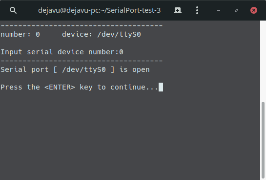
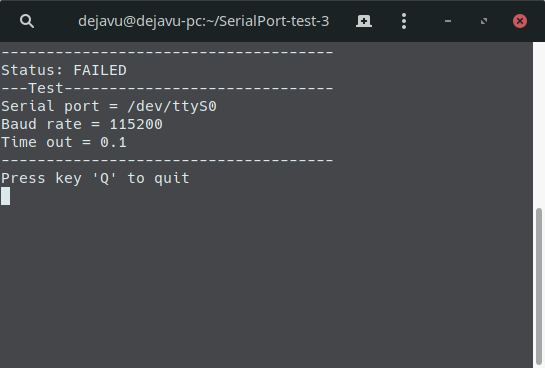
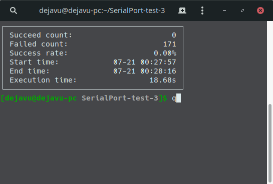
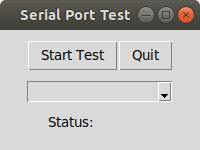
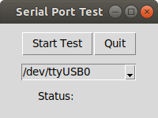
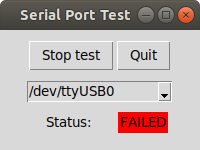
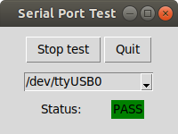

py-serial-test
Tx/Rx test tool for transmitting signal from system under test serial port to modem continuously.

## Environment
Language: Python 3

#### Supported operating system
* Ubuntu 18.04
* Manjaro 18.04(Gnome)
* windows server 2012R2
* windows server 2016

## Installation
##### Use the package manager pip to install pyserial.

`sudo pip install -r Requirement.txt`

##### Use the package manager apt to install tkinter.

Ubuntu `sudo apt-get install python3-tk`

Manjaro `sudo pacman -S tk`

## Execution
#### Text mode
    sudo python main.py

#### GUI mode
    sudo python mainui.py

## Image
### Text mode

### GUI mode

